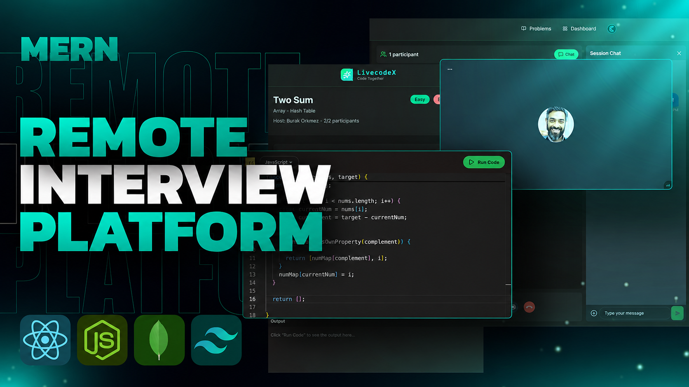

<h1 align="center">🚀 LivecodeX</h1>

<h3 align="center">
A Modern Full-Stack Live Coding Interview Platform
</h3>

<p align="center">
  Conduct live coding interviews with real-time video calling, collaborative code editing, secure authentication, coding practice, and multi-language code execution using an online compiler API.
</p>

<p align="center">
  
</p>

<p align="center">


</p>

---

# ✨ Features

### 👨‍💻 Coding Experience

- 💻 VS Code-like Monaco Editor
- 🌙 Dark & Light Theme Support
- 🌍 Multi-language Code Support
- ▶️ Real-time Code Execution
- 🧪 Custom Code Testing
- 📋 Copy Code
- 💾 Save Code
- 🧩 Coding Practice Mode
- 📚 Multiple Coding Problems
- 🎯 Automatic Test Case Evaluation

---

### 🎥 Live Interview

- 🎥 1-on-1 Video Interview Rooms
- 💬 Real-Time Chat
- 🎙️ Microphone Toggle
- 📷 Camera Toggle
- 🖥️ Screen Sharing
- 🎥 Interview Recording
- 🔒 Private Interview Rooms (Maximum 2 Participants)

---

### 🔐 Authentication

- Clerk Authentication
- Protected Routes
- User Profiles
- Secure Sessions

---

### 📊 Dashboard

- Live Interview Statistics
- Coding Dashboard
- Interview History
- Recent Activity

---

### ⚙️ Backend

- REST API using Express.js
- MongoDB Database
- Mongoose ODM
- Clerk Backend Authentication
- Inngest Background Jobs
- Stream Video SDK
- OnlineCompiler API integration
- Code execution API

---

### 🧪 Code Execution

- ⚡ Online code execution using OnlineCompiler API
- 🐍 Python execution
- ☕ Java execution
- 🔵 C execution
- 🟣 C++ execution
- ▶️ Run code directly from the Monaco Editor
- 📤 Program input support
- 📋 Real-time output display
- ❌ Compilation and runtime error handling
- 🎯 Automatic test case evaluation

---

### 🎨 UI/UX

- Responsive Design
- Modern UI
- Beautiful Animations
- Toast Notifications
- Confetti Animation
- Clean Dashboard

---

# 🛠 Tech Stack

## Frontend

- React.js
- Vite
- JavaScript
- JSX
- Tailwind CSS
- Monaco Editor
- React Router DOM
- TanStack Query
- Axios
- Clerk Authentication
- Stream Video SDK
- Framer Motion
- React Hot Toast

---

## Backend

- Node.js
- Express.js
- MongoDB
- Mongoose
- Clerk Backend SDK
- Inngest
- Stream SDK
- Axios
- OnlineCompiler API

---

# 📂 Project Structure

```text
LivecodeX
│
├── frontend
│   ├── public
│   ├── src
│   │   ├── components
│   │   ├── pages
│   │   ├── data
│   │   └── lib
│   └── package.json
│
├── backend
│   ├── src
│   │   ├── controller
│   │   ├── routes
│   │   ├── services
│   │   ├── middleware
│   │   └── lib
│   └── package.json
│
├── README.md
```

---

# 🧪 Environment Variables

## Backend (`backend/.env`)

```env
PORT=3000
NODE_ENV=development

DB_URL=your_mongodb_connection_url

CLIENT_URL=http://localhost:5173

CLERK_SECRET_KEY=your_clerk_secret_key

STREAM_API_KEY=your_stream_api_key
STREAM_API_SECRET=your_stream_api_secret

INNGEST_EVENT_KEY=your_inngest_event_key
INNGEST_SIGNING_KEY=your_inngest_signing_key

ONLINE_COMPILER_API_KEY=your_onlinecompiler_api_key
```

---

## Frontend (`frontend/.env`)

```env
VITE_API_URL=http://localhost:3000/api

VITE_CLERK_PUBLISHABLE_KEY=your_clerk_publishable_key

VITE_STREAM_API_KEY=your_stream_api_key
```

---

# 🚀 Installation

## Clone the Repository

```bash
git clone https://github.com/S-K-Roy18/LivecodeX.git

cd LivecodeX
```

---

## Install Backend

```bash
cd backend

npm install

npm run dev
```

Backend will run at:

```
http://localhost:3000
```

---

## Install Frontend

```bash
cd frontend

npm install

npm run dev
```

Frontend will run at:

```
http://localhost:5173
```

---

# 🚀 Deployment

| Service | Platform |
|----------|----------|
| Frontend | Vercel |
| Backend | Render |
| Database | MongoDB Atlas |
| Authentication | Clerk |
| Video & Chat | Stream |
| Code Execution | OnlineCompiler API |


---

# 📅 Roadmap

- ✅ Live Coding Editor
- ✅ Authentication
- ✅ Video Interviews
- ✅ Chat System
- ✅ Screen Sharing
- ✅ Dashboard
- ✅ Coding Practice
- ✅ Multi-language Code Execution
- ✅ Python Support
- ✅ Java Support
- ✅ C Support
- ✅ C++ Support
- ✅ Automatic Test Case Evaluation
- 🔄 Submission History
- 🔄 AI Interview Feedback
- 🔄 Collaborative Whiteboard

---

# 🤝 Contributing

Contributions are welcome!

1. Fork the repository

2. Create a feature branch

```bash
git checkout -b feature-name
```

3. Commit your changes

```bash
git commit -m "Added new feature"
```

4. Push the branch

```bash
git push origin feature-name
```

5. Open a Pull Request

---

# ⭐ Show Your Support

If you like this project, consider giving it a ⭐ on GitHub.

---

## 🌐 Connect With Me

<p align="left">

<a href="mailto:suryarahulroy321@gmail.com">
  
</a>

<a href="https://github.com/S-K-Roy18">
  
</a>

<a href="https://www.linkedin.com/in/surya-kanta-roy-363866338/">
  
</a>

</p>

---

# 📜 License

This project is licensed under the MIT License.

---

<p align="center">

Made with ❤️ by <b>Surya Kanta Roy</b>

</p>